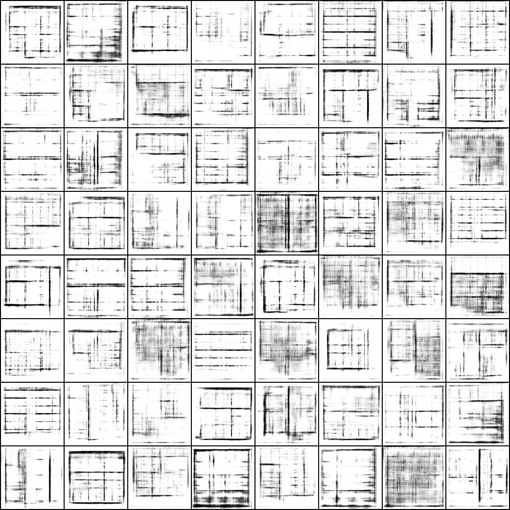
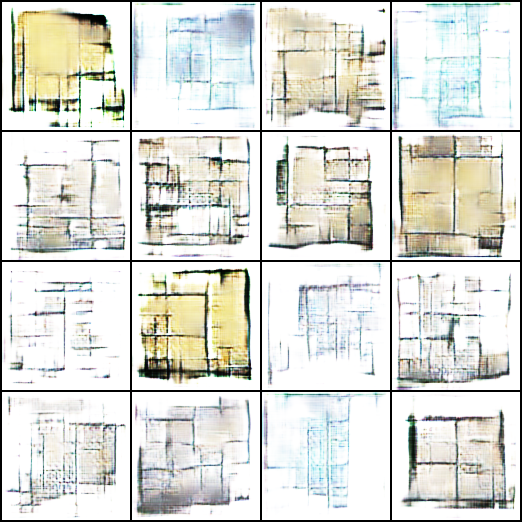
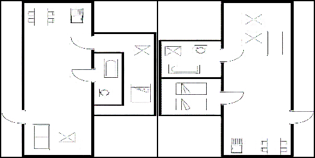

# Floor_Plan_Generation using Deep Neural Networks
This project explores the use of deep generative models for the task of automated architectural floorplan generation.
We experiment with three different types of generative adversarial networks (GANs):

DCGAN (Deep Convolutional GAN)

Pix2Pix (Conditional GAN)

SAGAN (Self-Attention GAN)

Each model is trained and evaluated on rasterized floorplan datasets (primarily CubiCasa5K and publicly sourced floorplan images).
Different preprocessing techniques were employed depending on the model architecture, ranging from noise vector generation to edge map conditioning and attention-based feature extraction.

The experiments involved:

Training DCGAN to synthesize floorplans from random noise vectors.

Training Pix2Pix with edge-map-to-floorplan translation tasks.

Training SAGAN with self-attention layers to generate globally consistent floorplan images.

Evaluating the generated outputs based on visual fidelity and structural realism.

Computing evaluation metrics like SSIM and PSNR for Pix2Pix outputs.

Below are the final outputs generated by each model:

Example Results
DCGAN
Generated floorplans from random noise after 100 epochs.   

Pix2Pix
Edge-map conditioned floorplan generation.   

SAGAN
Attention-driven floorplan generation capturing long-range dependencies.   
